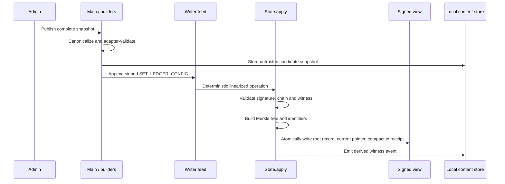
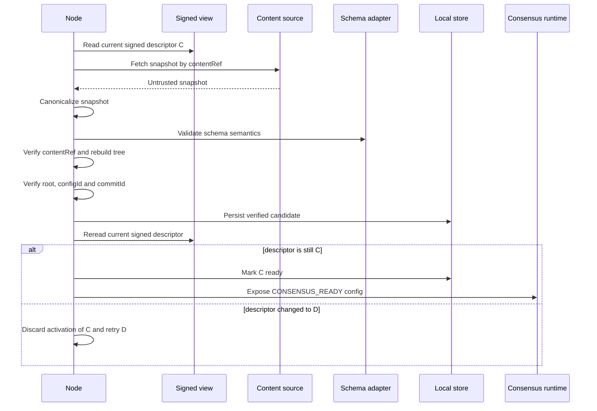

# LedgerConfig Model B Implementation Report

**Project:** Main Settlement Bus  
**Implementation status:** Implemented  
**Report date:** 2026-07-17  
**Storage model:** Model B — signed current pointer, immutable root history, and compact standard transaction receipts, with full snapshots and Merkle nodes stored off-chain

## 1. Executive summary

The ledger configuration mechanism has been redesigned as a clean-break implementation of Model B.

The signed Autobase/Hyperbee state now stores only the following ledger-configuration data:

- the commit identifier of the current ledger configuration;
- one immutable root record for every accepted configuration commit;
- one compact, versioned transaction receipt under the standard `<transactionHashHex>` key for every accepted configuration transaction.

The receipt contains the transaction hash, requester address, and accepted `LedgerConfigRootRecord`; it does not contain the complete operation or snapshot. Its standard 64-character hexadecimal key preserves the existing transaction index, confirmation-length lookup, range history, and transaction-detail APIs. The receipt itself also provides replay protection because a second apply of the same transaction finds the occupied transaction key.

Full configuration snapshots and Merkle nodes are not materialized in the signed view. They are transported as witnesses in `SET_LEDGER_CONFIG` writer-feed operations and persisted in a separate, derived, content-addressed local store. The complete operation remains recoverable from writer-feed history, while the signed transaction view exposes its compact deterministic outcome. Additional snapshot sources can be injected for peer or archive retrieval.

A node may participate in consensus only after it has:

1. read the authoritative descriptor from signed state;
2. obtained the corresponding untrusted snapshot;
3. validated the snapshot using the registered schema adapter;
4. rebuilt the canonical Merkle tree;
5. verified `contentRef`, `configRoot`, `configId`, and `commitId`;
6. reread the signed descriptor and confirmed that it did not change during verification.

The old `SET_VDF_PARAMS` operation and `/set_vdf_parameters` command have been removed. Proof-of-Time parameters are now one schema-specific interpretation of the generic `LedgerConfig` container.

## 2. Design goals

The implementation addresses the following requirements:

- signed state must not contain complete configuration snapshots or Merkle trees;
- historical configuration commitments must remain available without replaying all writer feeds;
- a node must never treat local cache data as authoritative;
- snapshot sources must be considered untrusted;
- configuration changes must form one deterministic, non-forking commit chain;
- a node must not enter consensus with missing, stale, corrupt, or unsupported configuration data;
- the shared storage format must not contain Proof-of-Time-specific fields;
- message builders and directors must remain the normal construction path for protocol messages;
- configuration identity must be included in genesis and consensus messages.

## 3. High-level architecture

```mermaid
flowchart LR
    A[Admin / builder] -->|SET_LEDGER_CONFIG with full witness| B[Writer feed]
    B --> C[Autobase linearizer]
    C --> D[State.apply]
    D -->|atomic writes| E[Signed state]
    E --> E1[/ledger-config/current]
    E --> E2[/ledger-config/roots/commitId]
    E --> E3[txHashHex receipt]
    D -. derived witness event .-> F[Local content store]
    G[Injected peer/archive sources] --> H[LedgerConfigSynchronizer]
    F --> H
    E --> H
    H -->|verified active config| I[Consensus readiness guard]
    I --> J[Proof-of-Time consensus]
```

The system has three separate trust domains:

| Component | Purpose | Authority |
| --- | --- | --- |
| Signed state | Selects the active commit, preserves root history, and indexes compact transaction outcomes | Authoritative |
| Writer-feed witness | Supplies a complete snapshot to deterministic apply and cache listeners | Untrusted until verified |
| Local content store / external source | Supplies snapshots and Merkle nodes to the synchronizer | Derived and untrusted until verified |

The signed descriptor selects the active configuration. Possession of a snapshot or a locally marked cache entry does not select or activate a configuration by itself.

## 4. Signed-state data model

### 4.1 State keys

The implementation uses the following signed Hyperbee keys:

```text
/ledger-config/current
/ledger-config/roots/<commitIdHex>
<transactionHashHex>
```

The first two keys belong to the ledger-configuration namespace. `<transactionHashHex>` is the same raw, lowercase, 64-character hexadecimal key space used by the existing transaction storage and history APIs. There is no ledger-config-specific transaction namespace.

`/ledger-config/current` contains the 32-byte identifier of the current commit.

`/ledger-config/roots/<commitIdHex>` contains a `LedgerConfigRootRecord`:

```text
LedgerConfigRootRecord {
  previousCommitId
  descriptor {
    formatVersion
    commitmentScheme
    schemaId
    configVersion
    configRoot
    configId
    commitId
    contentRef
  }
}
```

For most operation types, the standard transaction value remains the encoded `ApplyOperation`. A `SET_LEDGER_CONFIG` operation can contain a snapshot of up to 4 MiB, so storing that complete value again in the signed Hyperbee view would defeat Model B. Its standard transaction value is therefore a compact `LedgerConfigTransactionReceipt` instead.

### 4.2 Standard transaction receipt

The receipt is a separate protobuf body with explicit binary framing:

```text
00 4c 43 54 52 01 || protobuf(LedgerConfigTransactionReceipt)
^  ^-----------^ ^
|      LCTR      version 1
invalid ApplyOperation tag
```

The leading zero byte prevents the record from being interpreted as an `ApplyOperation`; `LCTR` identifies the record family; and the final prefix byte selects receipt version 1. Decoding also requires a canonical protobuf body and enforces a 2,048-byte receipt limit.

The logical body is:

```text
LedgerConfigTransactionReceipt {
  operationType = SET_LEDGER_CONFIG
  txHash
  requesterAddress
  rootRecord {
    previousCommitId
    descriptor
  }
}
```

The receipt deliberately omits `snapshot`, transaction-validity data, signatures, and the rest of the original authorization envelope. The original `SetLedgerConfigOperation` remains in the writer feed. The receipt records the accepted signed-view outcome without duplicating the large witness.

Receipt validation checks:

- framing, version, size, protobuf shape, and canonical encoding;
- `operationType = SET_LEDGER_CONFIG`;
- equality of `txHash` with the 64-hex storage key requested by the caller;
- requester-address length;
- all descriptor field and hash sizes;
- recalculated `configId` and `commitId`;
- the zero-predecessor rule for the first configuration and the non-zero rule for later versions.

Generic transaction reads first recognize and validate the receipt, then fall back to the existing `ApplyOperation` decoder for ordinary transactions. The internal wrapper marks the storage representation as `recordType: "ledger-config-receipt"`. JSON-facing transaction details explicitly identify the payload as:

```text
{
  type: SET_LEDGER_CONFIG,
  record_type: "ledger_config_receipt_v1",
  address,
  receipt: {
    tx,
    previous_commit_id,
    descriptor
  }
}
```

There is no `snapshot` in this response. `getConfirmedTxInfo()`, `getUnconfirmedTxInfo()`, `getTxDetails()`, `getExtendedTxDetails()`, bulk transaction reads, confirmation-length lookup, and confirmed transaction ranges continue to use the common transaction key space.

### 4.3 Commit chain

Every accepted configuration extends exactly one previous commit:

```text
ZERO_COMMIT_ID -> commit A -> commit B -> commit C
                                           ^
                                           current
```

The first configuration must reference the all-zero commit identifier. Every subsequent operation must reference the commit currently stored under `/ledger-config/current`.

The commit identifier is calculated as:

```text
commitId = BLAKE3(
  "ledger-config/commit/v1" || previousCommitId || configId
)
```

This makes configuration order part of the commitment. The same snapshot committed after different predecessors produces a different `commitId`.

### 4.4 Deterministic transition rules

`State.apply` rejects a configuration transition when:

- the first commit does not reference `ZERO_COMMIT_ID`;
- `previousCommitId` differs from the current signed commit;
- the current pointer or root record is malformed;
- the current root record does not validate;
- the derived root record already exists;
- the standard transaction key is already occupied;
- `configVersion` would overflow the supported safe-integer range.

The immutable root record, current pointer, and compact transaction receipt are written in one deterministic batch. Either all three become visible or none of them does.

## 5. Protocol and clean-break changes

### 5.1 New operation

Operation type `16` is now:

```text
SET_LEDGER_CONFIG
```

The operation is stored in the main apply-operation `oneof` as field `lco = 12`.

`SetLedgerConfigOperation` contains:

```text
tx
txv
previous_commit_id
snapshot
content_ref
in
is
```

The operation carries a complete snapshot witness. Derived values such as `configRoot`, `configId`, and `commitId` are intentionally omitted from the authorization envelope and are calculated independently by `State.apply`.

The same protocol file defines `LedgerConfigTransactionReceipt` as the compact signed-view outcome. The operation and receipt are intentionally different wire records: builders publish the complete operation to writer feeds, while deterministic apply derives the receipt only after accepting the transition.

### 5.2 Removed legacy mechanism

The following legacy elements were removed:

- `SET_VDF_PARAMS`;
- `SetVdfParamsOperation`;
- `set_vdf_params_operation.proto`;
- the `/parameters/vdf` signed-state entry;
- `EntryType.VDF_PARAMS`;
- `getSignedVDFParams()` and `requireSignedVDFParams()`;
- the VDF-specific apply handler;
- VDF-specific state message builder/director methods;
- `/set_vdf_parameters` and its CLI/Main handler.

There is no compatibility flag or fallback to locally configured/default VDF parameters.

### 5.3 Builder and director integration

`ApplyStateMessageBuilder` and `ApplyStateMessageDirector` construct complete `SET_LEDGER_CONFIG` messages. The signed request covers:

- network identity;
- transaction validity;
- previous commit identifier;
- the canonical snapshot bytes;
- `contentRef`;
- invoker nonce;
- operation type.

The Main API publishes generic snapshots through `handleSetLedgerConfig(snapshot)`. `handleSetProofOfTimeLedgerConfig(params)` is a convenience adapter that creates the two-entry Proof-of-Time snapshot and delegates to the generic method.

The interactive command is now:

```text
/set_ledger_config
```

## 6. Canonical snapshot format

A generic snapshot has the following logical structure:

```text
{
  formatVersion,
  commitmentScheme,
  schemaId,
  entries: [
    { key: Buffer, value: Buffer }
  ]
}
```

Canonicalization performs the following work:

- requires `formatVersion = 1`;
- requires `commitmentScheme = "binary-merkle-v1"`;
- requires a non-empty UTF-8 `schemaId` without unpaired surrogates;
- requires non-empty binary keys and binary values;
- copies all input buffers;
- sorts entries by byte-lexicographical key order;
- rejects duplicate keys;
- enforces protocol size limits;
- encodes all variable-length components with unsigned 32-bit length prefixes.

Current protocol limits are:

| Limit | Value |
| --- | ---: |
| Entries per snapshot | 1,024 |
| Key size | 256 bytes |
| Value size | 65,536 bytes |
| Schema identifier size | 256 bytes |
| Canonical snapshot size | 4 MiB |
| Encoded ledger-config operation size | 4 MiB + 4 KiB |

Large payloads are checked by a dedicated wire preflight scanner before full protobuf decoding. Other operation types retain their normal, smaller payload limit.

## 7. Merkle commitment construction

### 7.1 Domain separation

All commitments use BLAKE3 with explicit domains:

| Purpose | Domain |
| --- | --- |
| Leaf | `ledger-config/leaf/v1` |
| Internal node | `ledger-config/node/v1` |
| Empty tree | `ledger-config/empty/v1` |
| Configuration ID | `ledger-config/id/v1` |
| Commit ID | `ledger-config/commit/v1` |
| Content reference | `ledger-config/content/v1` |

### 7.2 Leaf and internal-node hashes

Leaf hashes commit to both lengths and bytes:

```text
leafHash = BLAKE3(
  LEAF_DOMAIN ||
  uint32(key.length) || key ||
  uint32(value.length) || value
)
```

Internal nodes are calculated as:

```text
nodeHash = BLAKE3(NODE_DOMAIN || leftHash || rightHash)
```

The empty tree has a dedicated domain-separated root.

### 7.3 Tree shape

Entries are sorted before tree construction. A non-power-of-two range is split at the largest power of two smaller than the range size. This produces one unambiguous tree shape without duplicating the last leaf.

The builder returns:

- the root hash;
- canonical leaf entries and their hashes;
- all content-addressed tree nodes;
- a `getProof(key)` closure for inclusion-proof generation.

Proofs contain the leaf index, leaf count, sibling position, sibling subtree size, and sibling hash. Verification reconstructs the exact expected proof shape and rejects malformed, reordered, incorrectly sized, or excessive proofs.

### 7.4 Derived identifiers

The configuration identifier commits to the shared container and root:

```text
configId = BLAKE3(
  ID_DOMAIN ||
  formatVersion ||
  commitmentScheme ||
  schemaId ||
  configRoot
)
```

The content reference commits to the complete canonical snapshot encoding:

```text
contentRef = BLAKE3(CONTENT_DOMAIN || canonicalSnapshotBytes)
```

Therefore:

- `contentRef` identifies exact snapshot content;
- `configRoot` commits to the key/value set;
- `configId` commits to the root and interpretation container;
- `commitId` commits to the configuration and its position in history.

## 8. Configuration publication flow



`State.apply` validates:

- protobuf/schema structure;
- `previousCommitId` and `contentRef` sizes;
- snapshot canonical form;
- exact `contentRef` match;
- requester address and administrator authorization;
- transaction hash and signature;
- transaction validity against signed indexer sequence state;
- replay protection through the standard transaction key;
- current commit-chain continuity;
- tree root and all derived identifiers;
- deterministic construction of the framed, snapshot-free transaction receipt.

The witness event is deliberately outside the signed-state decision. A cache listener failure cannot change the result of deterministic apply.

## 9. Local content-addressed store

The derived store uses a dedicated Hypercore/Hyperbee named:

```text
TracLedgerConfigModelBCacheV1
```

Its logical key spaces are:

```text
content/<contentRef>
nodes/<nodeHash>
manifests/<commitId>
ready/current
```

The store persists:

- canonical snapshots addressed by `contentRef`;
- leaves and internal nodes addressed by their hashes;
- verified root-record manifests addressed by `commitId`;
- a derived readiness record containing signed length and descriptor metadata.

`putCandidate()` revalidates the complete relationship among snapshot, tree, descriptor, previous commit, and derived identifiers before writing anything. Existing immutable content is reused. Corrupt derived entries can be replaced with verified data, while a valid but conflicting immutable manifest raises a conflict error.

`getSnapshot()`, `getNode()`, and `getManifest()` verify content again when reading it. The local `ready/current` record is not trusted on startup; the synchronizer clears readiness and performs a fresh signed-state verification cycle.

## 10. Node synchronization algorithm

### 10.1 Snapshot sources

The synchronizer tries sources in this order:

1. the local content-addressed store;
2. each injected snapshot source.

An injected source may be a function or an object exposing `getSnapshot(descriptor)`. Sources receive a cloned descriptor and are treated as untrusted. The default per-source timeout is 30 seconds.

### 10.2 Verification and double-read guard

The synchronization sequence is:



The descriptor comparison encodes and compares the complete root record, including the previous commit and all descriptor fields. Comparing only `configVersion` or only the root is not sufficient.

The default synchronizer allows eight consecutive attempts when signed state changes during verification. If the moving target cannot be stabilized, synchronization remains fail-closed and the Main retry scheduler tries again later.

### 10.3 Single-flight and lifecycle behavior

Concurrent synchronization requests share one in-flight promise. Base `update` and `fast-forward` events schedule synchronization without creating overlapping verification loops.

Main also:

- drains outstanding witness-cache writes before explicit synchronization;
- retries retryable failures at a configurable interval, defaulting to five seconds;
- cancels source waits when closing;
- clears derived readiness during shutdown;
- prevents a late cache write from restoring consensus readiness after closure.

### 10.4 Synchronizer statuses

The observable state machine uses:

| Status | Meaning |
| --- | --- |
| `NOT_READY` | No verified active configuration is exposed |
| `SYNCING_LEDGER` | Signed metadata is being read or has changed |
| `CONFIG_UNAVAILABLE` | Required content or signed metadata is unavailable |
| `CONFIG_VERIFYING` | Candidate content is being validated |
| `UNSUPPORTED_CONSENSUS` | No adapter exists for the signed `schemaId` |
| `CONSENSUS_READY` | The active snapshot and tree match a freshly reread descriptor |
| `CLOSED` | Synchronizer is closed and cannot expose readiness |

### 10.5 Fresh readiness guard

Consensus does not rely solely on a previous successful synchronization. Every call to `requireConsensusReady()` freshly rereads signed state and compares it with the in-memory active configuration.

If the descriptor has changed, disappeared, or cannot be read, readiness is invalidated before the call fails. This prevents a previously valid cache entry from remaining active after a signed-state update.

## 11. Long histories and configuration changes during synchronization

Signed history remains deterministic regardless of its length:

- Autobase defines one linearized apply order;
- each configuration must extend the current commit;
- stale forks are rejected;
- every accepted root record remains immutable;
- the current pointer moves atomically with the new record;
- identical canonical input produces identical roots and identifiers on every replica.

Nodes do not need to fetch every historical snapshot before entering consensus. They replicate the signed root history but synchronize and verify the currently selected snapshot.

If configuration C changes to D while C is being downloaded or rebuilt, the final signed reread detects the mismatch. C may remain as harmless content-addressed cache data, but it is not activated. The synchronizer restarts verification for D.

The storage growth characteristics are:

| Data | Growth |
| --- | --- |
| Signed root history | One small root record per accepted commit |
| Signed current pointer | Constant |
| Signed transaction receipts | One small, snapshot-free receipt per accepted transaction |
| Off-chain snapshots | One record per unique `contentRef` retained locally |
| Off-chain Merkle nodes | Content-addressed; identical nodes are reused |

Historical roots remain available from signed state. Historical key/value data remain available only while the corresponding snapshot and nodes are retained locally or by an external source.

## 12. Relationship between local trees and `State.apply`

The persistent local Merkle tree is not used by `State.apply` as an authority.

There are two distinct tree-building paths:

1. `SET_LEDGER_CONFIG` apply builds a transient deterministic tree directly from the full witness contained in the operation. This is consensus-safe because every replica receives the same linearized operation and applies the same pure rules.
2. `LedgerConfigSynchronizer` independently rebuilds a persistent local tree from off-chain content. This tree is used by runtime code, configuration reads, and proof generation after signed-state verification.

`State.apply` never reads the local content store or synchronizer. Doing so would make apply dependent on node-local availability and could cause replica divergence.

For any future apply operation that needs an off-chain configuration value, the operation must carry a self-verifying inclusion proof or multiproof:

```text
operation {
  configId
  key
  value
  inclusionProof
}
```

The sender may use its local tree to generate the proof. The validator must verify the supplied proof against the signed `configRoot` and must not trust its own cache.

## 13. Schema adapters and Proof-of-Time

The shared descriptor is consensus-neutral. Interpretation is selected by `schemaId` through a sealed `LedgerConfigAdapterRegistry`.

The built-in Proof-of-Time schema is:

```text
trac/autobase-proof-of-time/v1
```

It currently requires exactly two entries:

| Key | Encoding | Constraint |
| --- | --- | --- |
| `vdf/difficulty` | 4-byte unsigned big-endian integer | Greater than zero |
| `vdf/discriminant-size-bits` | 2-byte unsigned big-endian integer | Greater than zero |

The adapter rejects unknown, missing, or duplicate Proof-of-Time keys and returns an immutable runtime object:

```text
{
  vdfDifficulty,
  vdfDiscriminantSize
}
```

Adapter results are normalized into deeply copied, immutable plain data. Accessors, cycles, symbol properties, exotic prototypes, sparse arrays, and prototype-pollution keys are rejected before the result is exposed to consensus.

Publication through Main requires a locally registered adapter and semantic validation. Generic `State.apply` remains container-level and schema-neutral; a node that receives a signed descriptor for an unavailable adapter reaches `UNSUPPORTED_CONSENSUS` and does not participate in consensus.

## 14. Genesis and consensus integration

### 14.1 Genesis

Genesis epoch initialization no longer accepts VDF parameters directly. It requires a signed and synchronized active Proof-of-Time configuration and signs its `configId` in `SetGenesisEpochOperation`.

The sequence is therefore:

```text
initialize admin
    -> publish SET_LEDGER_CONFIG
    -> synchronize and verify active config
    -> initialize genesis epoch with configId
```

`State.apply` verifies that the genesis operation references the exact current signed configuration identifier.

### 14.2 Proof proposals

`ProofProposal` field 6 is now `config_id`. The proposal signature, VDF challenge, approval signature, and response construction all include this identifier.

Consensus request validation requires:

- an active, freshly guarded Proof-of-Time configuration;
- an exact match between proposal `config_id` and the active descriptor;
- VDF verification using parameters decoded from that active configuration.

Approval validation also compares the proposal with the current active `configId`. Immediately before signing an `OK` approval, the handler performs another fresh readiness check. If configuration changes between request validation and response signing, no stale approval is produced.

Network and epoch-proposal lifecycle code do not start Proof-of-Time participation without a consensus-ready configuration.

### 14.3 Apply-side epoch binding

`SET_EPOCH` apply decodes the proof proposal and verifies that its `config_id` exactly matches the current signed root record. Missing, malformed, unavailable, or mismatched configuration metadata causes deterministic rejection.

The apply path does not read the local tree or decoded VDF parameters.

## 15. Failure behavior and security properties

| Condition | Result |
| --- | --- |
| Snapshot missing locally and from all sources | `CONFIG_UNAVAILABLE`; consensus remains stopped |
| Snapshot source times out | Source rejected; other sources may be tried |
| Snapshot has wrong `contentRef` | Candidate rejected |
| Snapshot builds a different root | Candidate rejected |
| Snapshot uses another schema/container | Candidate rejected |
| Adapter rejects snapshot semantics | Candidate rejected |
| `configId` or `commitId` mismatch | Candidate rejected |
| Local cached node or manifest is corrupt | Read fails or verified content repairs the derived entry |
| Signed descriptor changes during verification | Candidate is not activated; synchronization retries the new descriptor |
| Signed descriptor changes after readiness | Fresh guard invalidates readiness |
| Adapter for `schemaId` is unavailable | `UNSUPPORTED_CONSENSUS` |
| Source never settles | Per-source timeout or shutdown cancellation terminates the wait |
| Node closes during synchronization | Readiness cleared; pending operations cannot reactivate it |
| Stale configuration transition | Deterministically rejected by `State.apply` |
| A `SET_LEDGER_CONFIG` transaction key already exists | Replay is ignored before a new state transition is written |
| Receipt framing or canonical body is malformed | Transaction detail read fails; the value is not treated as an `ApplyOperation` |
| Receipt hash does not match its transaction key | Transaction detail read rejects the record |
| Receipt `configId` or `commitId` is inconsistent | Transaction detail read rejects the record |
| Legacy VDF state is the only available configuration | No fallback; consensus remains stopped |

The implementation therefore provides:

- deterministic signed-state convergence;
- content integrity independent of the snapshot transport;
- explicit schema interpretation;
- race-safe activation;
- fail-closed consensus gating;
- replay and stale-fork protection;
- standard transaction-history visibility without signed snapshot duplication;
- separation of authoritative state from node-local optimization data.

## 16. Availability and retention

Model B guarantees integrity but does not make full snapshot availability a property of signed state.

With the repository's current `fastForward: false` behavior, a node performing a full writer-feed replay sees every `SET_LEDGER_CONFIG` witness. The Main listener can therefore rebuild the local content-addressed cache while state is replayed.

The synchronizer also accepts injected snapshot sources for other recovery and distribution strategies. However, the default entry points do not currently provide a concrete peer/archive distribution protocol.

Consequences:

- a normal full replay can reconstruct cached snapshots from operation witnesses;
- a normal restart can reuse the persistent content store after full revalidation;
- the compact transaction receipt cannot replace a missing snapshot because it intentionally contains only commitment metadata;
- a node that has signed state but loses the matching local content needs an injected source, replay-based recovery, or operator repair;
- if no valid source can provide the active snapshot, the node remains safely outside consensus;
- full historical values require deliberate snapshot retention even though historical roots remain signed.

A production deployment should define:

- snapshot retention duration;
- peer or archive source discovery;
- redundancy and backup policy;
- recovery procedure for a lost `TracLedgerConfigModelBCacheV1` core;
- monitoring for `CONFIG_UNAVAILABLE`, `CONFIG_VERIFYING`, and `UNSUPPORTED_CONSENSUS`.

## 17. Known limitations and separate follow-up work

### 17.1 Complete `SET_EPOCH` certificate validation

The current `SET_EPOCH` apply path is bound to the exact active `config_id`, but it is not yet a complete deterministic epoch-certificate validator.

The existing broader consensus implementation still lacks an apply-safe combination of:

- proposer and approval signature verification inside apply;
- unique approval aggregation;
- executable committee-membership and quorum rules;
- VDF parameter inclusion witnesses against `configRoot`;
- apply-side VDF verification;
- complete next-epoch and previous-record validation;
- atomic writes of the new epoch record, hash, and current pointer;
- a complete end-to-end proposal collector and appender.

This cannot be solved safely by reading the local synchronized tree inside apply. A proper follow-up must add inclusion witnesses or multiproofs to the `SET_EPOCH` wire format, or explicitly choose to materialize the required values in signed state.

### 17.2 Unsupported schema publication

The shared apply contract deliberately validates the generic container and commitment, not schema-specific semantics. This preserves the generic root-history format. A direct authorized operation can therefore commit a schema unsupported by current nodes, after which they fail closed with `UNSUPPORTED_CONSENSUS`.

Operational governance must ensure that adapters are deployed before a configuration using a new `schemaId` is published.

### 17.3 External content distribution

The source interface, timeouts, verification, retries, and fail-closed behavior are implemented. A concrete network peer/archive protocol and retention service remain deployment-specific follow-up work.

## 18. Operational rollout

This implementation is a breaking protocol change.

Operators must not mix nodes that use `SET_VDF_PARAMS` with nodes that use `SET_LEDGER_CONFIG`. They must also agree on the framed `ledger_config_receipt_v1` transaction representation. The protobuf operation, genesis message, consensus proposal semantics, state layout, transaction decoding, and runtime readiness rules have changed.

For a legacy environment, choose one explicit strategy:

1. reset the development/test ledger and create a new genesis sequence; or
2. design and test a separate coordinated state/protocol migration.

There is no automatic migration in this implementation.

Recommended clean deployment order:

1. deploy the same Model B-capable software version to all nodes;
2. initialize the administrator;
3. publish the initial Proof-of-Time configuration with `/set_ledger_config`;
4. wait until nodes report `CONSENSUS_READY` for the same `configId`;
5. initialize the genesis epoch;
6. enable normal consensus participation;
7. monitor snapshot retention and synchronization statuses.

### 18.1 Runtime diagnostics

The interactive `/ledger_config` command prints one JSON-safe diagnostic view containing:

- signed and unsigned view lengths;
- synchronizer status, readiness, and the last synchronization error;
- the current signed root descriptor and the complete predecessor chain;
- the local ready cache record and whether it matches signed state;
- the active snapshot, adapter-decoded values, Merkle entries, and all tree nodes;
- the genesis and current epoch proofs, including decoded proposal and approvals;
- verification that the stored epoch-proof hash matches its payload; and
- the exact historical configuration to which genesis is bound.

Signed data and derived local cache data are deliberately displayed in separate sections. The command is read-only and does not call the consensus readiness guard or mutate synchronization state.

## 19. Verification evidence

The verification workflow covers:

- regenerated protobuf codecs;
- ESLint over the repository;
- `git diff --check`;
- a production-code search confirming removal of legacy VDF operation/state APIs;
- full Node and Bare unit regression suites;
- targeted consensus-handler race tests on Node and Bare.

Dedicated test coverage includes:

- canonical snapshot encoding and protocol limits;
- deterministic Merkle roots and inclusion proofs;
- content-store persistence, corruption checks, and conflict handling;
- synchronization double-read races;
- unavailable, invalid, stale, and unsupported content;
- source timeouts and shutdown cancellation;
- fail-closed readiness transitions;
- immutable signed root history and stale-fork rejection;
- receipt framing, canonical encoding, size bounds, and malformed-body rejection;
- receipt transaction-key, requester-address, `configId`, and `commitId` validation;
- standard `<transactionHashHex>` storage and replica convergence without snapshot duplication;
- explicit `ledger_config_receipt_v1` results from confirmed, unconfirmed, detail, and bulk transaction APIs;
- genesis/config identifier binding;
- consensus proposal and approval identifier binding;
- complete `/ledger_config` diagnostics, including genesis binding to a non-current historical configuration;
- CLI clean break and retirement of `/set_vdf_parameters`;
- Node and Bare runtime compatibility.

## 20. Implementation map

| Area | Main files |
| --- | --- |
| Protocol messages | `proto/applyOperations/messages/set_ledger_config_operation.proto` |
| Operation registration | `proto/applyOperations/applyOperations.proto`, `proto/applyOperations/enums/operation_type.proto` |
| Root-record and transaction-receipt codecs | `src/codecs/apply/ledgerConfigCodec.js` |
| Canonical encoding and Merkle tree | `src/core/ledger-config/ledgerConfigMerkle.js` |
| Protocol limits and domains | `src/core/ledger-config/ledgerConfigConstants.js` |
| Persistent derived store | `src/core/ledger-config/LedgerConfigContentStore.js` |
| Safe synchronization | `src/core/ledger-config/LedgerConfigSynchronizer.js` |
| Read-only runtime diagnostics | `src/core/ledger-config/ledgerConfigDiagnostics.js` |
| Synchronizer statuses | `src/core/ledger-config/ledgerConfigStatus.js` |
| Adapter registry | `src/core/ledger-config/adapters/LedgerConfigAdapterRegistry.js` |
| Proof-of-Time adapter | `src/core/ledger-config/adapters/ProofOfTimeLedgerConfigAdapter.js` |
| Deterministic apply and signed reads | `src/core/state/State.js` |
| Apply builders and directors | `src/messages/state/ApplyStateMessageBuilder.js`, `src/messages/state/ApplyStateMessageDirector.js` |
| Main lifecycle, publication, and transaction decoding | `src/index.js` |
| Consensus readiness boundary | `src/core/consensus/requireProofOfTimeConsensusConfig.js` |
| Consensus messages | `proto/consensus/v1/messages/proof_proposal.proto` |
| CLI | `cli/commandHandler.js`, `cli/handlers.js` |
| Tests | `tests/unit/ledger-config/`, `tests/unit/codecs/ledgerConfigTransactionReceipt.test.js`, `tests/unit/state/apply/setLedgerConfig/`, `tests/unit/state/ledgerConfigSignedRead.test.js`, `tests/unit/state/transactionHistory.test.js`, `tests/unit/index.test.js` |

## 21. Conclusion

The implementation realizes Model B as a root-only signed configuration history with independently verifiable off-chain content. Compact standard transaction receipts duplicate only the accepted commitment metadata, never the complete snapshot witness.

Signed state deterministically decides which configuration is active. Every accepted configuration remains discoverable through the same transaction key space as existing operations and is returned with an explicit `ledger_config_receipt_v1` shape. Full snapshots and Merkle nodes remain derived and replaceable. A node can obtain content from any source, but it can enter consensus only when the content reconstructs the exact descriptor committed by signed state and the descriptor remains unchanged across the verification window.

The local Merkle tree is an optimization and proof-generation facility, not an apply authority. Deterministic apply either builds a transient tree from an operation witness or, for future configuration-dependent operations, must verify self-contained proofs against the signed root.

This separation provides the central safety property of Model B: node-local availability may differ, but no valid node can silently activate configuration data that does not match the signed ledger commitment.
